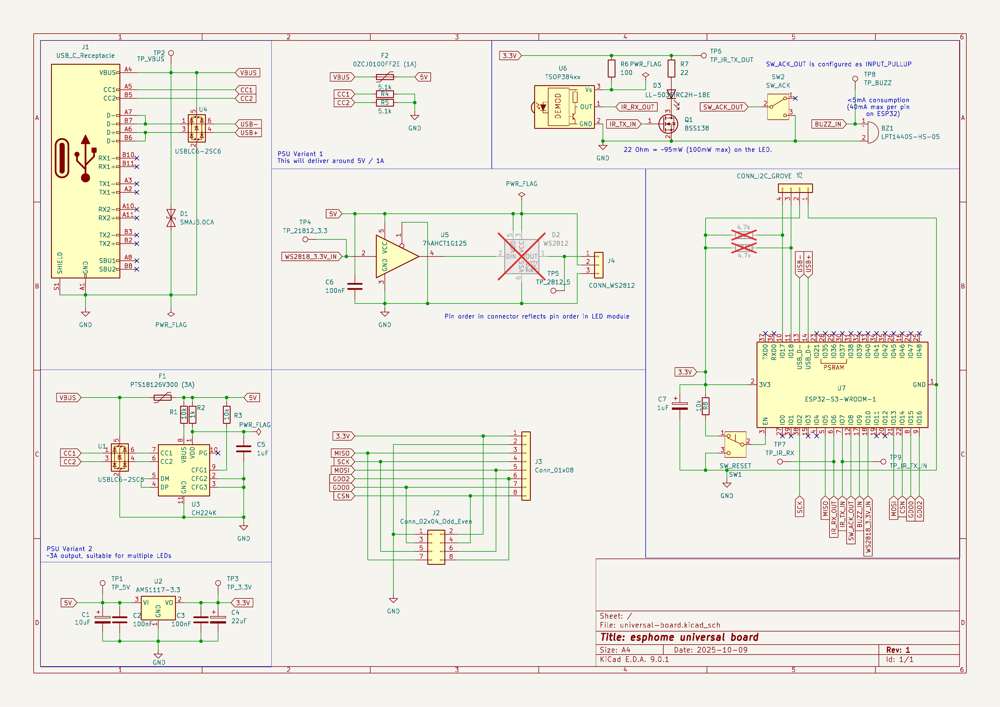

# [esphome.io](https://esphome.io)-compatible universal board

* Can control an air conditioning unit and read its remote to display current state of unit.
* Can drive multiple WS2812 LEDs to indicate something.
* Can drive a buzzer to indicate something.
* Notifications using the above can be acknowledged with a click of a button.
* Can read the state of a water meter which uses WMBUS using a CC1101 module.
* Can incorporate additional sensors via I2C.

## Parts

* ESP32 Module [ESP32-S3-WROOM-1](https://www.espressif.com/sites/default/files/documentation/esp32-s3-wroom-1_wroom-1u_datasheet_en.pdf)
* IR Receiver: [TSOP38438](https://www.vishay.com/docs/82491/tsop382.pdf)
* IR Transmitter 850nm @ 165mW: [LL-503SIRC2H-1BE](https://www.tme.eu/Document/bbc76b3f66c79fcebc4b2a3071fa53b8/LL-503SIRC2H-1BE.pdf)
* USB PD Controller: [CH224K](https://www.laskakit.cz/user/related_files/ch224ds1.pdf)
* CC1101 868MHz module: [Small](https://ae01.alicdn.com/kf/H425240e05325482f9e129bee543d8c9eR.jpg) or [Large](https://ae01.alicdn.com/kf/S28ad7d5c77624d52bd05b87e7f74fee7y.jpg)
* Level shifter: [74AHCT1G125](https://www.ti.com/lit/ds/symlink/sn74ahct1g125.pdf)
* Buzzer: [LPT1440S-HS-05](https://www.tme.eu/Document/ccb72bb5ba4b269fcfcf63562faa0900/LPT1440S-HS-05-4.0-12-R.pdf)
* Presence sensors
  * [HLK-LD2450](https://www.tinytronics.nl/product_files/006000_HLK-LD2450-Instruction-Manual.pdf)
  * [HLK-LD2402](https://drive.google.com/file/d/1SmigbSjFt1toA7W5wEuI2Qy-1CSR6PQn/view)
  * [HLK-LD2410](https://www.tinytronics.nl/product_files/006002_HLK-LD2410S_datasheet.pdf)

## Other

* [A Primer on USB Type-C® and USB Power Delivery Applications and Requirements](https://www.ti.com/lit/wp/slyy109b/slyy109b.pdf)

## TODO for rev 3

* Place everything on one side of the board!
* Add another footprint for WS2812B and WS2812S, so that either can be populated
* Do we need to use electrolytic capacitors?
* ~~Get rid of the 3A PSU circuit.~~
* Replace LED transmitter with a 940nm part, for example TSAL6200 (narrow beam), OSI5LA56A1A, IR7393C (100mA), OSI5NE87B1A, IR323/H0-A, IR8294, OSI5LA7WA1B.
* Hook up the output of the WS2812 correctly.
* Holes in the board need to be slightly bigger.
* ~~22-33 ohm series resistors on the USB pins: USB-C <-> ESD <-> R <-> USB on ESP32.~~
